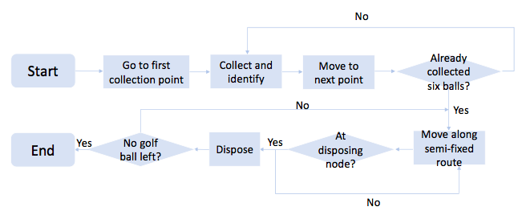
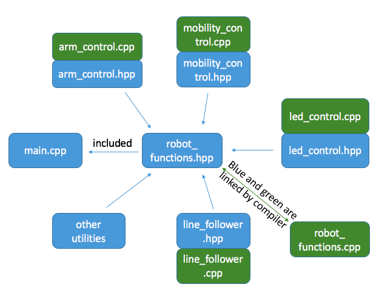
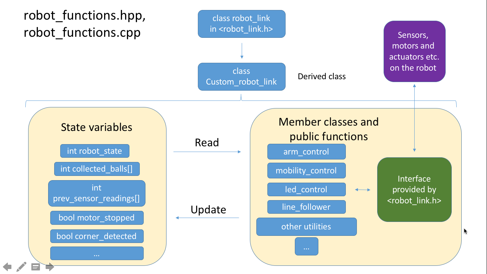

# IDP M109 Software Documentation

## Setup and Compilation Instructions

### How to compile the source code
1. Login to the Linux (CentOS) system on a workstation in EIETL.
2. Put all source code in one directory (e.g. ```src```), and name the main program (the file that contains the main() function) ```main.cpp```.
3. Drag ```main.cpp``` in the directory to the ```IDPgeany-arm``` icon on the desktop. If there is no such icon, click ```Applications - CUED 2nd Year - Start 1BRobot``` at the top left corner of the screen.
4. A ```Makefile``` file is generated, and a geany window should pop up. To compile the source, click ```Build - Make``` or press Shift + F9 in the geany window. Alternatively, just type ```make``` in the terminal under the source code directory.

### How to upload the compiled program to the microcomputer:

1. Connect the microcomputer to power, and wait until the blue LED of the Wi-Fi card is on.
3. In the source code folder, right click and choose Open in Terminal.
4. If the name of the compiled file is ```main.arm```, type ```uploadT9``` and hit ENTER in the terminal and skip the next step.
5. Type scp FILENAME team@wlan-robot7.private:FILENAME, replace FILENAME with the compiled file name ```***.arm```
6. When ask for password, use the one on the side of the microcomputer.

### How to login to the microcomputer and run the program:

1. Open terminal
2. Type lg9, hit ENTER
3. When ask for password, use the one on the side of the microcomputer.
4. Run your uploaded program. For example, if your compiled program name is ```main.arm```, just type ```./main.arm``` and hit ENTER.

## The Overall Function of the Software System



## Program Modules and Structures
- File and module structures

- Datatypes and C++ class interface
        
        +- class robot_link
        |
        |
        |Public Inheritance
        |
        |
        +- class Custom_robot_link
        |
        +----class arm_control
        |
        +----class mobility_control
        |
        +----class led_control
        |
        +----class line_follower



## Interface to the Mechanical and Electrical subsystems

- READ_PORT_7: receives digital input ranging from 0 to 31. It corresponds to a binary 5-digit number.
The four least significant bits are the line following sensor inputs. The input varies from 0000 to 1111. They correspond to a four-digit binary number, each digit representing one sensor. For example, if the binary number is 1101, it means the first, third, and fourth sensor has value True while sensor two has value False.
The most significant bit represents the state of the LDR, which detects color. 0 is for a color and 1 is for the other one.

- WRITE_PORT_7: gives outputs to actuators. The signal ranges from 0 to 3. It corresponds to a binary 2-digit number from 00 to 11. The actuator is set to True(high voltage) if the digit is 1, and False(low voltage) if the digit is 0.

- WRITE_PORT_6: gives outputs to LED displays. This ranges from 0 to 255. This could represent all possible LED configurations.

- ADC7: receives the voltage corresponding to the weight of the ball collected. This is a digital number ranging from 0 to 255. 0 represents no weight(after calibration) while 255 represents the heaviest weight.

- MOTORS: motors have their separate pins and will be discussed further in low level procedures.


## Example datatype: ```class arm_control```

    +-class arm_control
    |
    |
    +----int current_orientation
    +----int current_angle
    +----bool ball_grabbed
    +----bool actuator1_activated
    +----bool actuator2_activated
    |
    |
    +----void grab_ball()
    +----void get_ball_color()
    +----void get_ball_weight()
    +----void release_ball()
    +----void rotate_arm()

## Low level procedures:

- Moving the motors: rlink.command(BOTH_MOTORS_GO_SAME, speed) to move the robot forward or backward. Due to stability concerns, moving backward is only used when no other choice is available.
- Turning the robot: rlink.command(BOTH_MOTORS_GO_OPPOSITE, speed). The speed parameter to achieve this need further calibration.
- Reading inputs:
    - From READ_PORT_7: v = rlink.request (READ_PORT_7)
    - From ADC input: v = rlink.request (ADC7)
- Writing outputs:
    - To WRITE_PORT_7: rlink.command (WRITE_PORT_7, v)

## Bill of Materials (BoM)
1. Estimated source files:
    - main.cpp: the core control program containing the main() function.
    - robot_functions.hpp and robot_functions.cpp: the header file and implementation file for the Custom_robot_link class, and other utilities.
    - arm_control.hpp and arm_control.cpp for controlling the mechanical arm and pneumatic actuator to collect and deliver the balls.
    - mobility_control.hpp and mobility_control.cpp to control the motors to move the robot forward and perform manoeuvres.
    - led_control.hpp and led_control.cpp for LED control to indicate ball type and robot status.
    - line_follower.hpp and line_follwer.cpp subroutine module
2. Estimated lines of code for each module
    - main: 200 lines
    - robot_functions: 150 lines
    - arm_control: 150 lines
    - mobility_control: 100 lines
    - led_control: 50 lines
    - line_follower: 100 lines
3. Summary:
    - Total number of source files: 11
    - Total number of lines of code required: 750

# List of subroutines and associated size
- line_follower - 100 lines
- arm_control.grab\_ball() - 30 lines
- arm\_control.get\_ball_weight() - 20 lines
- arm\_control.get\_ball_color() - 30 lines
- arm\_control.release\_ball() - 20 lines
- mobility_control::basic maneuvers(e.g. forward, stop, back) - 20 lines
- mobility_control.turn(int degrees) - 50 lines
- mobility_control.goto\_next\_point() - 30 lines
- led_control - 50 lines

## A list of three sub-systems operations
1. Line following > 0.75m
2. Turning at a corner
3. Grabbing a ball